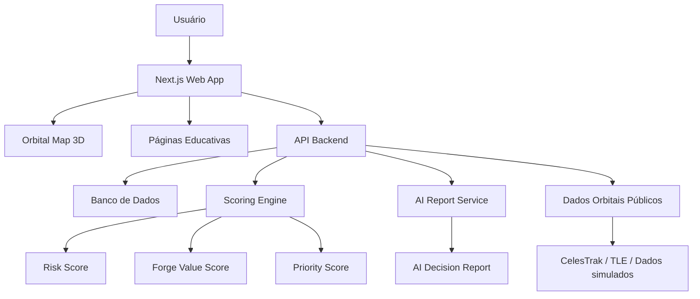

<div align="center">

# Kessler Platform

### Inteligência orbital para risco, prevenção e economia circular do lixo espacial.

**Visualizar. Entender. Priorizar. Reaproveitar.**

</div>

---

## 1. Ideia central

O **KesslerOS** é uma plataforma web para explorar o problema do lixo espacial de forma visual, inteligente e prática.

A aplicação não tenta substituir empresas, agências ou sistemas profissionais de rastreamento orbital. A proposta é outra: criar uma camada acessível de **visualização, educação, análise de risco, simulação e reaproveitamento** em cima de dados e conceitos reais da área espacial.

Hoje, boa parte da conversa sobre lixo espacial gira em torno de remover ou monitorar objetos. O KesslerOS amplia essa visão:

> E se o lixo espacial não fosse apenas um risco, mas também o primeiro estoque de matéria-prima da economia espacial?

A plataforma nasce dessa pergunta.

---

## 2. O problema

A órbita da Terra está cada vez mais ocupada. Satélites ativos, satélites desativados, corpos de foguete e fragmentos antigos continuam circulando em alta velocidade ao redor do planeta.

Esse acúmulo cria três desafios importantes.

### 2.1 Risco orbital

Um pequeno fragmento pode atingir satélites, estações ou outros objetos em órbita. Uma colisão gera novos fragmentos, que aumentam o risco de novas colisões.

Esse efeito transforma o lixo espacial em um problema de longo prazo.

### 2.2 Dependência da Terra

O lixo espacial parece distante, mas afeta estruturas que usamos todos os dias:

- GPS;
- internet via satélite;
- previsão do tempo;
- telecomunicações;
- agricultura de precisão;
- logística global;
- monitoramento ambiental;
- resposta a desastres.

Cuidar da órbita também é cuidar da infraestrutura invisível que sustenta parte da vida moderna.

### 2.3 Falta de visão circular

Já existem iniciativas para rastrear, prevenir e remover detritos. Mas a ideia de transformar parte desse material em recurso ainda é pouco madura.

O KesslerOS entra nesse espaço: ele olha para o lixo espacial como **risco técnico** e também como **possível recurso futuro**.

---

## 3. Proposta de valor

| Camada | O que entrega | Valor para o projeto |
|---|---|---|
| **Prevenção** | Explica boas práticas e responsabilidades orbitais | Mostra que o projeto pensa no futuro, não só no problema atual |
| **Mapa 3D** | Exibe objetos em órbita de forma interativa | Torna o problema visível e fácil de apresentar |
| **Passaporte Orbital** | Mostra dados e contexto de cada objeto | Transforma objetos técnicos em informações compreensíveis |
| **Risk Score** | Estima risco de colisão, permanência e reentrada | Ajuda a priorizar atenção |
| **Forge Value Score** | Estima potencial de reaproveitamento | Traz a inovação da economia circular espacial |
| **Priority Queue** | Ordena os objetos mais relevantes | Converte dados em decisão |
| **Mission Simulator** | Simula inspeção, remoção ou reaproveitamento | Mostra aplicação prática sem depender de hardware real |
| **AI Decision Report** | Explica decisões em linguagem natural | Torna a análise mais clara, defensável e educativa |

---

## 4. Posicionamento do projeto

O KesslerOS deve ser apresentado como um **protótipo acadêmico de inteligência orbital**, não como uma solução operacional para segurança espacial real.

### O que o projeto não promete

- prever colisões reais com precisão profissional;
- competir com LeoLabs, Slingshot, CelesTrak, NASA ou ESA;
- confirmar exatamente se cada satélite cumpriu todas as normas;
- reciclar detritos espaciais fisicamente no protótipo.

### O que o projeto promete

- usar dados públicos e simulações para tornar o problema mais compreensível;
- mostrar como software pode apoiar decisões sobre lixo espacial;
- criar uma experiência visual e educativa sobre congestionamento orbital;
- propor uma camada de priorização baseada em risco, valor e viabilidade;
- explorar a economia circular orbital como conceito inovador.

Esse cuidado deixa a ideia mais honesta e mais forte.

---

# 5. Produto

O KesslerOS pode ser desenvolvido como um **web app em Next.js**, com navegação simples e visual limpo.

A experiência ideal parece menos com um sistema burocrático e mais com um painel moderno de exploração: poucas palavras por tela, dados bem distribuídos, gráficos discretos, mapa em destaque e explicações claras.

---

## 5.1 Home

### Papel na aplicação

Apresentar o problema e posicionar o KesslerOS.

A Home deve funcionar como a porta de entrada da ideia. O usuário precisa entender em poucos segundos que lixo espacial é um problema real, atual e ligado ao futuro da economia espacial.

### Conteúdo

- frase principal da plataforma;
- resumo do problema;
- cards com os módulos principais;
- chamada para explorar o mapa orbital;
- números ou indicadores visuais sobre objetos em órbita;
- breve explicação sobre risco, prevenção e reaproveitamento.

### Valor

A Home dá contexto antes da parte técnica. Ela evita que o projeto pareça apenas um mapa bonito e mostra a visão completa da proposta.

---

## 5.2 Orbital Map

### Papel na aplicação

Permitir que o usuário explore objetos orbitais em um globo 3D.

Essa é a tela mais visual do projeto. Ela aproxima o usuário do problema e transforma algo abstrato em uma experiência navegável.

### Funções

- visualizar a Terra em 3D;
- exibir objetos orbitais;
- filtrar por tipo de objeto;
- filtrar por órbita;
- destacar objetos com maior risco;
- selecionar um objeto para abrir o Passaporte Orbital.

### Dados possíveis

- objetos públicos de bases como CelesTrak;
- dados simulados para complementar a experiência;
- classificação por tipo: satélite, corpo de foguete, fragmento ou desconhecido.

### Valor

O mapa cria impacto imediato na apresentação. Em vez de explicar o congestionamento orbital com texto, o projeto permite que o usuário veja e explore.

---

## 5.3 Object Passport

### Papel na aplicação

Mostrar a ficha de um objeto orbital selecionado.

Cada objeto ganha um “passaporte”, reunindo dados técnicos, riscos, estimativas e possibilidades de reaproveitamento.

### Informações exibidas

- nome do objeto;
- identificador NORAD, quando disponível;
- tipo de objeto;
- data de lançamento;
- órbita estimada;
- altitude aproximada;
- inclinação;
- perigeu e apogeu;
- status estimado;
- risco orbital;
- risco de reentrada;
- potencial de reaproveitamento;
- recomendação inicial.

### Camadas de confiança

Como nem todos os dados estarão disponíveis, a interface pode usar selos como:

- **confirmado por base pública**;
- **estimado pelo sistema**;
- **informação indisponível**;
- **composição provável**.

### Valor

O passaporte dá identidade ao objeto. Ele deixa de ser apenas um ponto no mapa e passa a ser uma peça com história, risco e possível utilidade.

---

## 5.4 Prevention Hub

### Papel na aplicação

Explicar como novas missões podem evitar a criação de mais lixo espacial.

Essa seção trata da parte preventiva do problema. Antes de discutir remoção e reciclagem, a plataforma mostra que a melhor solução é não piorar o cenário.

### Conteúdo

- o que é mitigação de detritos;
- o que significa desorbitar;
- o que é passivação;
- o que é órbita cemitério;
- por que missões precisam de plano de fim de vida;
- exemplos de boas práticas defendidas por agências espaciais;
- importância de pensar o descarte antes do lançamento.

### Função interativa

#### Responsible Orbit Checker

Um simulador onde o usuário cadastra uma missão fictícia e recebe uma nota de responsabilidade orbital.

Campos possíveis:

- tipo de satélite;
- altitude da missão;
- vida útil planejada;
- plano de descarte;
- combustível reservado para fim de missão;
- estratégia de passivação;
- risco de fragmentação.

Saída exemplo:

> **Responsible Orbit Score: 78/100**  
> A missão possui plano de descarte, mas ainda manteria o objeto por muito tempo em uma região movimentada.

### Valor

Essa parte mostra maturidade. O projeto não fala apenas de “limpar o espaço”, mas também de projetar missões mais responsáveis desde o início.

---

## 5.5 Traffic Control

### Papel na aplicação

Simular riscos de aproximação entre objetos orbitais.

A ideia não é criar um sistema real de segurança espacial, mas demonstrar como decisões de tráfego orbital poderiam ser apoiadas por software.

### Funções

- selecionar um satélite ou objeto;
- visualizar aproximações simuladas;
- classificar alertas em baixo, médio, alto ou crítico;
- sugerir ações como monitorar, revisar, priorizar ou simular manobra;
- gerar histórico de alertas.

### Exemplo de painel

| Alerta | Objeto | Nível | Ação sugerida |
|---|---|---:|---|
| Aproximação simulada | Objeto A-104 | Médio | Monitorar |
| Região congestionada | Corpo de foguete B-88 | Alto | Priorizar análise |
| Possível reentrada futura | Detrito C-12 | Baixo | Acompanhar |

### Valor

Essa página conecta o KesslerOS ao problema de congestionamento orbital. Ela mostra que o desafio não é apenas ter muitos objetos em órbita, mas entender quais deles exigem atenção primeiro.

---

# 6. Núcleo inteligente

O coração do KesslerOS está nos scores. Eles transformam dados técnicos em decisões simples.

---

## 6.1 Risk Score

### Papel na aplicação

Estimar o risco de um objeto orbital.

### Critérios possíveis

- altitude;
- tipo de órbita;
- massa estimada;
- tamanho estimado;
- tipo de objeto;
- tempo em órbita;
- proximidade de regiões movimentadas;
- possibilidade de fragmentação;
- risco de reentrada;
- histórico ou simulação de aproximações.

### Saída

> **Risk Score: 86/100**  
> Objeto de alta prioridade. Permanece em região movimentada e possui características compatíveis com risco orbital relevante.

### Valor

O Risk Score simplifica a leitura técnica. Ele ajuda o usuário a entender rapidamente quais objetos merecem mais atenção.

---

## 6.2 Forge Value Score

### Papel na aplicação

Estimar o potencial de reaproveitamento de um objeto.

Esse é o ponto mais autoral do KesslerOS.

### Critérios possíveis

- massa estimada;
- tipo de objeto;
- material provável;
- facilidade de captura;
- risco de manuseio;
- potencial para blindagem;
- potencial para peças estruturais;
- potencial para fabricação orbital;
- custo estimado de transformação;
- utilidade para futuras estações ou habitats.

### Saída

> **Forge Value Score: 82/100**  
> Alto potencial de reaproveitamento estrutural. O objeto pode ser estudado como fonte de material metálico para blindagem ou componentes simples.

### Valor

A maioria das soluções olha para detritos como ameaça. O Forge Value Score propõe outra camada: detritos como matéria-prima.

É aqui que o KesslerOS deixa de ser apenas um rastreador e vira uma plataforma de economia circular espacial.

---

## 6.3 Orbital Priority Score

### Papel na aplicação

Combinar risco, valor e viabilidade em uma única prioridade.

### Lógica conceitual

```txt
Orbital Priority Score =
  risco orbital
+ valor de reaproveitamento
+ impacto da remoção
+ viabilidade da missão
- custo estimado
- risco operacional
```

### Exemplo

| Prioridade | Objeto | Risk | Forge Value | Viabilidade | Decisão |
|---:|---|---:|---:|---:|---|
| 1 | Corpo de foguete A | 91 | 84 | 63 | Inspecionar e planejar remoção |
| 2 | Satélite morto B | 76 | 88 | 52 | Avaliar reaproveitamento |
| 3 | Fragmento C | 89 | 20 | 31 | Monitorar risco |
| 4 | Painel D | 42 | 67 | 78 | Candidato a coleta futura |

### Valor

A fila de prioridade é o cérebro da aplicação. Ela mostra que o KesslerOS não apenas exibe dados; ele organiza decisões.

---

# 7. Priority Queue

### Papel na aplicação

Listar os objetos que mais merecem atenção.

### Funções

- ranking por prioridade geral;
- filtro por risco;
- filtro por valor de reaproveitamento;
- filtro por viabilidade;
- comparação entre objetos;
- acesso rápido ao simulador de missão;
- explicação resumida da decisão.

### Valor

Essa tela é essencial para a apresentação. Ela resume a inteligência do sistema em uma lista clara, objetiva e defensável.

---

# 8. Mission Simulator

### Papel na aplicação

Simular ações possíveis para um objeto orbital.

A plataforma não remove lixo espacial de verdade. Ela mostra como uma decisão de missão poderia ser analisada.

### Tipos de missão

- **Monitorar** — acompanhar sem ação imediata;
- **Inspecionar** — enviar missão para obter mais dados;
- **Deorbitar** — reduzir a órbita para reentrada controlada ou segura;
- **Mover** — deslocar para uma região menos crítica;
- **Capturar** — simular captura por veículo orbital;
- **Reciclar** — tratar o objeto como fonte de material.

### Dados exibidos

- custo estimado;
- tempo estimado;
- risco operacional;
- benefício ambiental orbital;
- materiais recuperáveis;
- prioridade da missão;
- explicação da IA.

### Exemplo de resultado

> Missão recomendada: **inspeção antes da captura**.  
> O objeto possui alto risco orbital e bom potencial de reaproveitamento, mas sua composição exata é desconhecida. A próxima etapa mais segura seria uma missão de inspeção.

### Valor

O simulador transforma a ideia em ação. Ele mostra como o KesslerOS poderia apoiar decisões estratégicas sobre remoção, inspeção e reaproveitamento.

---

# 9. Circular Economy Lab

### Papel na aplicação

Explorar como detritos orbitais poderiam virar recursos.

Essa é a parte mais inovadora do produto.

### Funções

- estimar materiais prováveis;
- sugerir usos futuros;
- calcular valor potencial;
- mostrar limitações técnicas;
- comparar reaproveitamento versus descarte;
- gerar hipóteses de fabricação orbital.

### Possíveis usos

| Material ou componente | Possível uso futuro |
|---|---|
| Alumínio estrutural | estruturas leves, suportes e painéis |
| Titânio ou aço | peças resistentes e componentes mecânicos |
| Painéis solares | estudo de degradação ou recuperação parcial |
| Cabos e conectores | desmontagem técnica ou reaproveitamento limitado |
| Componentes eletrônicos | triagem, descarte controlado ou recuperação específica |
| Estruturas metálicas | blindagem contra micrometeoritos ou radiação |
| Satélite desativado | plataforma de teste, inspeção ou desmontagem |

### Valor

O laboratório apresenta a visão mais forte do KesslerOS:

> transformar lixo espacial em cadeia de suprimentos orbital.

Essa abordagem conecta sustentabilidade, economia espacial e inovação de forma mais original do que apenas monitorar detritos.

---

# 10. AI Decision Report

### Papel na aplicação

Explicar as decisões do sistema em linguagem natural.

### O que a IA explica

- por que um objeto tem risco alto;
- por que ele deve ser monitorado, inspecionado ou removido;
- por que possui valor de reaproveitamento;
- quais dados foram usados;
- quais limitações existem;
- qual seria a próxima ação recomendada.

### Exemplo

> O objeto recebeu prioridade alta porque combina risco orbital relevante com bom potencial de reaproveitamento. Sua órbita indica permanência prolongada, e seu tipo sugere presença de material estrutural útil. Como a composição exata não foi confirmada por dados públicos, a recomendação inicial é realizar uma inspeção antes de qualquer tentativa de captura.

### Valor

A IA torna o sistema mais claro. Em vez de entregar apenas números, o KesslerOS mostra o raciocínio por trás da recomendação.

Isso ajuda muito na defesa do projeto.

---

# 11. Impact Dashboard

### Papel na aplicação

Mostrar o impacto potencial das decisões simuladas.

### Indicadores

- objetos analisados;
- objetos de alto risco;
- missões simuladas;
- massa potencialmente reaproveitável;
- risco orbital reduzido em simulação;
- valor estimado de material recuperado;
- missões com plano de fim de vida;
- objetos com dados insuficientes.

### Valor

O dashboard fecha a história do produto. Ele mostra resultado, não só funcionalidade.

---

# 12. Arquitetura sugerida



---

# 13. Stack recomendada

| Camada | Tecnologia | Motivo |
|---|---|---|
| Frontend | Next.js + TypeScript | estrutura moderna e boa para apresentação |
| UI | TailwindCSS | visual limpo, responsivo e rápido de construir |
| Visualização 3D | CesiumJS ou Three.js | globo orbital interativo |
| Cálculo orbital | satellite.js | leitura e simulação com dados TLE |
| Backend | API Routes, Express ou NestJS | endpoints e regras de negócio |
| Banco | PostgreSQL ou Supabase | persistência simples para protótipo |
| ORM | Prisma | modelagem limpa dos dados |
| IA | OpenAI, OpenRouter ou modelo local | explicações e relatórios |
| Deploy | Vercel + Supabase | caminho simples para demo online |

---

# 14. Modelo de dados inicial

## `orbital_objects`

Objeto orbital rastreado ou simulado.

- `id`
- `norad_id`
- `name`
- `object_type`
- `launch_date`
- `orbit_type`
- `inclination`
- `perigee`
- `apogee`
- `status`
- `source`
- `created_at`
- `updated_at`

## `risk_assessments`

Análise de risco de um objeto.

- `id`
- `orbital_object_id`
- `risk_score`
- `reentry_risk`
- `collision_risk`
- `risk_level`
- `explanation`
- `created_at`

## `reuse_assessments`

Análise de potencial de reaproveitamento.

- `id`
- `orbital_object_id`
- `forge_value_score`
- `estimated_material`
- `possible_uses`
- `reuse_level`
- `limitations`
- `created_at`

## `mission_simulations`

Simulações de missão.

- `id`
- `orbital_object_id`
- `mission_type`
- `estimated_cost`
- `estimated_duration`
- `operational_risk`
- `expected_benefit`
- `ai_recommendation`
- `created_at`

## `responsible_orbit_checks`

Simulações de prevenção e responsabilidade orbital.

- `id`
- `mission_name`
- `orbit_type`
- `has_end_of_life_plan`
- `has_passivation_plan`
- `disposal_strategy`
- `responsible_orbit_score`
- `result_summary`
- `created_at`

---

# 15. MVP

O MVP deve ser grande o suficiente para parecer completo, mas simples o bastante para ser construído.

## Essencial

1. Home com explicação do problema.
2. Prevention Hub.
3. Mapa orbital 3D com dados públicos ou simulados.
4. Object Passport.
5. Risk Score.
6. Forge Value Score.
7. Priority Queue.
8. Mission Simulator.
9. Circular Economy Lab.
10. AI Decision Report.

## Futuro

- login;
- salvar missões;
- exportar relatório;
- marketplace fictício de sucata orbital;
- aplicativo mobile para alertas;
- simulação animada de colisão;
- modo professor/demo.

---

# 16. Telas do protótipo

| Tela | Objetivo | Componentes principais |
|---|---|---|
| **Home** | apresentar a visão | hero, cards, resumo, CTA |
| **Orbital Map** | explorar objetos | globo 3D, filtros, lista lateral |
| **Object Passport** | detalhar um objeto | dados, scores, recomendação |
| **Priority Queue** | priorizar atenção | ranking, filtros, decisão sugerida |
| **Mission Simulator** | simular ação | tipo de missão, custo, risco, resultado |
| **Circular Economy Lab** | mostrar reaproveitamento | materiais, usos, limitações |
| **Prevention Hub** | educar e prevenir | boas práticas, checker, score |
| **Impact Dashboard** | medir resultado | indicadores, gráficos, métricas |

---

# 17. Por que funciona para Engenharia de Software

O KesslerOS permite demonstrar várias áreas do curso em uma única solução.

| Área | Aplicação no projeto |
|---|---|
| Web | dashboard, mapa, páginas e fluxo de navegação |
| APIs | objetos orbitais, scores, missões e relatórios |
| Banco de dados | objetos, análises, simulações e histórico |
| IA | relatórios, justificativas e recomendações |
| Dados | uso de bases públicas e modelos de score |
| UX/UI | visualização 3D, cards, tabelas e dashboards |
| Sustentabilidade | prevenção e economia circular |
| Arquitetura | separação entre frontend, API, banco, scoring e IA |
| Inovação | reaproveitamento orbital como cadeia de valor |

---

# 18. Diferencial

O KesslerOS não é apenas um mapa de lixo espacial.

Ele combina:

```txt
prevenção
+ visualização orbital
+ risco
+ priorização
+ simulação de missão
+ reaproveitamento
+ explicação por IA
```

Essa combinação transforma a aplicação em uma plataforma de decisão.

A visão final é simples:

> O lixo espacial não precisa ser visto apenas como ameaça. Ele pode ser o primeiro recurso industrial da economia espacial.

---

# 19. Pitch

> **KesslerOS** é uma plataforma web de inteligência orbital que usa dados públicos, IA e simulação para visualizar lixo espacial, estimar riscos, priorizar detritos críticos e explorar como esses materiais poderiam ser reaproveitados em uma futura economia circular espacial.

---

# 20. Versão curta para apresentar

O KesslerOS ajuda a entender e priorizar o problema do lixo espacial. A plataforma mostra objetos em órbita, calcula risco, sugere prioridade de atenção e estima como certos detritos poderiam ser reaproveitados no futuro.

A proposta une conscientização, rastreamento, controle de tráfego, simulação de remoção e economia circular em uma experiência interativa.

O protótipo não pretende remover lixo espacial fisicamente. Ele demonstra como software, dados e IA podem apoiar decisões sobre a sustentabilidade da órbita terrestre.

---

# 21. Referências conceituais

- NASA Orbital Debris Program Office;
- ESA Zero Debris Charter;
- CelesTrak;
- ClearSpace-1;
- Astroscale;
- LeoLabs;
- Slingshot Aerospace.

---

<div align="center">

## KesslerOS

**Transformando lixo espacial em inteligência orbital.**

</div>
